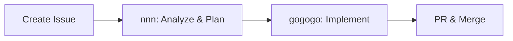

# Claude Instructions - Simple Brewing

## Simplified Brewing Workflow

**🔴 ALWAYS USE GITHUB FLOW - NO DIRECT COMMITS TO MAIN**

1. Create issue with your idea, recipe image, or research topic
2. Run `nnn [issue-number]` to analyze and create plan
3. Run `gogogo` to implement the plan
4. Review and merge PR

That's it! Simple brewing for humans.

## Structure
```
brews/
├── 01-research/    # What I learned
├── 02-recipes/     # What I'm making
├── 03-notes/       # How it went
├── 04-templates/   # Simple templates
├── 05-images/      # Recipe and brew images
└── 99-archive/     # Old stuff
```

## Key Commands
```bash
# Create issue with your brewing content
gh issue create --title "[Recipe/Research/Idea]: [Name]"

# Analyze and plan
nnn [issue-number]    # Creates implementation plan

# Implement 
gogogo               # Implements the most recent plan

# Other useful commands
lll                  # Show project status
rrr                  # Create session retrospective (optional)
```

## Guidelines
- Keep it simple
- Focus on brewing, not process
- Research and recipes should link to their originating issues
- Notes can be added directly to main (no issue needed)
- **IMPORTANT**: Always use GitHub flow (issue → branch → PR) for ALL changes except:
  - Minor typo fixes in documentation
  - Emergency hotfixes
  - Brew notes (as specified above)

## Quality Checks
- Recipes should have: ingredients, process, notes
- Research should have: what learned, sources
- That's it - no mandatory sections or complex validation

## Quick Reference - Short Codes
- `nnn [issue-id]` - Analyze issue and create implementation plan (auto-extracts images if needed)
- `qqq [issue-id]` - Extract images from issue (usually auto-handled by nnn)
- `lll` - List comprehensive project status
- `rrr` - Create detailed session retrospective (optional)
- `gogogo` - Start implementing the plan from nnn

## Core Short Codes

### `nnn` - Analyze & Plan
When you see `nnn` or `nnn [issue-number]`:

**Purpose**: Analyze a brewing issue (recipe, research, idea) and create an implementation plan. This is the PRIMARY planning command for the brewing project.

**Usage**:
- `nnn` - Analyzes the most recent open issue
- `nnn 23` - Analyzes specific issue #23

**Step 1: Read Target Issue**
```bash
# If issue number provided
gh issue view [issue-number]

# If no issue number, get most recent
gh issue list --limit 1
```

**Step 2: Auto-Extract Images (if present)**
If the issue contains images, automatically run `qqq` to extract them.

**Step 3: Analyze Content**
- For recipes: Identify ingredients, process, missing information
- For research: Determine scope, resources needed, output format
- For ideas: Clarify requirements, break down into tasks

**Step 4: Create Implementation Plan**
Create a plan based on the issue type:
```bash
gh issue create --title "plan: Clear description of what needs to be done" --body "$(cat <<'EOF'
## Implementation Plan

**Context From**: #[context-issue-numbers]
**Type**: [feature/fix/refactor/optimization]

## Problem Statement
[Clear description of what needs to be solved/implemented]

## Visual Reference
[If following qqq, embed the extracted images]


## Extracted Content
[If following qqq, include key extracted data]

## Research Summary
### Current Implementation Analysis
- How it currently works
- What files/components are involved
- Existing patterns in the codebase

### Technical Constraints
- Performance considerations
- Security implications
- Compatibility requirements

### Similar Implementations
- Examples from codebase
- Best practices discovered

## Proposed Solution

### Architecture Overview
[High-level design and approach]

### Implementation Plan
1. **Phase 1: [Name]**
   - Step 1.1: [Specific action]
   - Step 1.2: [Specific action]
   - Files to modify: [list]

2. **Phase 2: [Name]**
   - Step 2.1: [Specific action]
   - Step 2.2: [Specific action]
   - New files needed: [list]

3. **Phase 3: Testing**
   - Unit tests needed
   - Integration tests
   - Manual testing checklist

### Code Structure
```typescript
// Example interfaces/types needed
interface ProposedStructure {
  // ...
}

// Example component structure
ComponentName/
├── index.tsx
├── hooks.ts
└── types.ts
```

### Technical Details
- **Dependencies**: New packages needed
- **API Changes**: Endpoints affected
- **State Management**: How data flows
- **Database**: Schema changes if any

## Risk Analysis
- **Risk 1**: [Description] → Mitigation: [Strategy]
- **Risk 2**: [Description] → Mitigation: [Strategy]

## Alternative Approaches Considered
1. **Approach A**: [Description] - Rejected because [reason]
2. **Approach B**: [Description] - Rejected because [reason]

## Success Criteria
- [ ] Feature implemented according to spec
- [ ] All tests passing
- [ ] No performance regression
- [ ] Documentation updated
- [ ] Code reviewed and approved

## Estimated Effort
- Research: Already completed
- Implementation: ~X hours
- Testing: ~X hours
- Total: ~X hours

## Questions/Blockers
- [ ] Question 1 that needs clarification
- [ ] Potential blocker to resolve

## Next Steps
1. Review and approve this plan
2. Create feature branch
3. Begin implementation following the plan

## References
- Related PR: #XXX
- Similar implementation: [file:line]
- Documentation: [link]
EOF
)"
```

```bash
gh issue create --title "plan: [Description based on original issue]" --body "$(cat <<'EOF'
## Implementation Plan

**Source Issue**: #[issue-number] - [issue-title]
**Type**: [recipe/research/brew-notes]

## Objective
[Clear statement of what needs to be done]

## Extracted Content (if applicable)
[Images extracted and analyzed]
[Key data points identified]

## Implementation Steps
1. [Specific action]
2. [Specific action]
3. [Specific action]

## Output
- [ ] File to create: brews/[appropriate-folder]/[filename].md
- [ ] Format: [recipe/research/notes]
- [ ] Link back to issue #[number]

## Success Criteria
- [ ] All information from issue captured
- [ ] Follows established format
- [ ] Ready for brewing/reference
EOF
)"
```

**Step 5: Provide Summary**
After creating the plan:
- Confirm plan issue created
- Note any missing information
- Ready for `gogogo` implementation

**Example Flows:**
```
# Recipe from image
User: nnn 23
AI: 1. Reads issue #23 (German Blonde Ale image)
    2. Auto-extracts image with qqq
    3. Creates plan: "Document German Blonde Ale recipe"
    4. "Plan created in issue #24. Ready for implementation."

# Research topic
User: nnn 15  
AI: 1. Reads issue #15 ("Research hop varieties")
    2. Creates plan: "Research and document hop varieties"
    3. "Plan created in issue #16. Ready for implementation."
```

### GitHub Flow Implementation

**🔴 CRITICAL**: ALWAYS follow GitHub flow for ALL implementation work. NO EXCEPTIONS for recipes, features, or any code changes.

**Step 1: Create feature branch from issue**
```bash
gh issue develop [issue-number] --name "feat/brief-description"
# This automatically:
# - Creates a new branch
# - Checks out the branch
# - Links branch to issue
```

**Step 2: Implement changes**
- Work on the feature branch
- Make commits with clear messages
- Test your changes

**Step 3: Create Pull Request**
```bash
# First push the branch
git push -u origin [branch-name]

# Then create PR
gh pr create --fill
# Or with custom title/body:
gh pr create --title "feat: Description" --body "Fixes #[issue-number]"
```

**Step 4: Merge (after review/approval)**
```bash
# Manual merge:
gh pr merge [pr-number] --delete-branch

# Or set auto-merge:
gh pr merge --auto --delete-branch
```

### `gogogo` - Implementation
When you see `gogogo`:

**Purpose**: Implement the plan created by `nnn`. Always follows GitHub flow.

**Automatic Steps**:
1. Find the most recent plan issue
2. Create feature branch: `gh issue develop [plan-issue] --name "feat/[description]"`
3. Implement according to plan
4. Commit and push: `git add -A && git commit -m "[message]" && git push -u origin [branch]"`
5. Create PR: `gh pr create --fill`
6. Close original issue (not plan issue) in PR description

**Example Flow:**
```
User: nnn 23
AI: Creates plan issue #24 "plan: Document German Blonde Ale recipe"

User: gogogo
AI: 1. gh issue develop 24 --name "feat/german-blonde-ale-recipe"
    2. Creates brews/02-recipes/issue-23-german-blonde-ale.md
    3. git add -A && git commit -m "feat: Document German Blonde Ale recipe from issue #23"
    4. git push -u origin feat/german-blonde-ale-recipe
    5. gh pr create --fill --body "Closes #23"
    6. "PR created: [link]"
```

**⚠️ REMINDER**: If you accidentally commit to main:
1. Create a new branch from current state: `git checkout -b fix/accidental-main`
2. Reset main: `git checkout main && git reset --hard origin/main`
3. Push the branch and create PR as normal

**Direct commits to main allowed ONLY for:**
- Minor typo fixes in documentation (single word changes)
- Emergency hotfixes (with user explicit approval)
- Brew notes in 03-notes/ directory

### `lll` - List Project Status
When you see `lll`, execute in parallel:
```bash
gh issue list --limit 20
gh issue list --state closed --limit 10
gh pr list --state all --limit 10
gh issue list --label "context"
gh issue list --label "feat"
git status
```

Then provide a visual summary:
```
📊 Project Status Summary
========================
🔧 Open Issues: X total
  - 🏷️ feat: X
  - 🐛 bug: X
  - 📝 context: X

🔄 Recent PRs:
  - ✅ Merged: X
  - 📭 Open: X
  - ❌ Closed: X

📍 Current Focus: [from latest issues]
```

### `qqq` - Quick Query Images (Usually Auto-Handled)
When you see `qqq [issue-number]`:

**Purpose**: Extract images from GitHub issues. Note: `nnn` automatically runs this when needed, so you rarely need to use it directly.

**When to use manually**:
- Testing image extraction
- Re-extracting after issue update
- Extracting images without creating a plan

**What it does**:
1. Downloads all images from the issue
2. Extracts text content
3. Comments extracted text back to issue
4. Creates extraction record for reference

### `rrr` - Retrospective
When you see `rrr`:

**Step 1: Export Full Conversation**
```
/export session_YYYY-MM-DD_HH-MM.md
```
- This creates a markdown file of the entire conversation
- The AI will show the exact filename to use (e.g., `session_2025-07-10_07-33.md`)
- Save the downloaded file to: `retrospectives/exports/`

**Step 2: Gather Session Data**
```bash
# Get modified files
git diff --name-only main...HEAD

# Get commit history
git log --oneline main...HEAD

# Get current time for end time (GMT+7)
# UTC time
date -u +"%H:%M UTC"
# Local time (GMT+7)
TZ='Asia/Bangkok' date +"%H:%M GMT+7"
# Session date
date +"%Y-%m-%d"
```

**Step 3: Create Retrospective Document**
```bash
# Get session date and times
SESSION_DATE=$(date +"%Y-%m-%d")
END_TIME_UTC=$(date -u +"%H:%M")
END_TIME_LOCAL=$(TZ='Asia/Bangkok' date +"%H:%M")

# Create directory structure
mkdir -p retrospectives/$(date +%Y/%m)

# Create retrospective file with auto-filled date/time
cat > retrospectives/$(date +%Y/%m)/${SESSION_DATE}_${END_TIME_UTC//:/-}_retrospective.md << EOF
# Session Retrospective

**Session Date**: ${SESSION_DATE}
**Start Time**: [FILL_START_TIME] GMT+7 ([FILL_START_TIME] UTC)
**End Time**: ${END_TIME_LOCAL} GMT+7 (${END_TIME_UTC} UTC)
**Duration**: ~X minutes
**Primary Focus**: Brief description
**Session Type**: [Feature Development | Bug Fix | Research | Refactoring]
**Current Issue**: #XXX
**Last PR**: #XXX
**Export**: retrospectives/exports/session_${SESSION_DATE}_${END_TIME_UTC//:/-}.md

## Session Summary
[2-3 sentence overview of what was accomplished]

## Timeline
- HH:MM - Started session, reviewed issue #XXX
- HH:MM - [Event]
- HH:MM - [Event]
- HH:MM - Completed implementation

## Technical Details

### Files Modified
```
[paste git diff --name-only output]
```

### Key Code Changes
- Component X: Added Y functionality
- Module Z: Refactored for better performance

### Architecture Decisions
- Decision 1: Rationale
- Decision 2: Rationale

## AI Diary
[Detailed narrative of the development process, challenges faced, solutions explored]

## What Went Well
- Success 1
- Success 2
- Success 3

## What Could Improve
- Area 1
- Area 2

## Blockers & Resolutions
- **Blocker**: Description
  **Resolution**: How it was solved

## Honest Feedback
[Frank assessment of the session, tools, process]

## Lessons Learned
- **Pattern**: [Description] - [Why it matters]
- **Mistake**: [What happened] - [How to avoid]
- **Discovery**: [What was learned] - [How to apply]

## Next Steps
- [ ] Immediate task 1
- [ ] Follow-up task 2
- [ ] Future consideration

## Related Resources
- Issue: #XXX
- PR: #XXX
- Export: [session_YYYY-MM-DD_HH-MM.md](../exports/session_YYYY-MM-DD_HH-MM.md)
EOF
```

**Step 4: Update CLAUDE.md**
- Copy any new lessons learned to the Lessons Learned section
- Add any new patterns or anti-patterns discovered
- Update user preferences if any were observed

**Step 5: Link to GitHub**
```bash
# Add retrospective to git
git add retrospectives/
git commit -m "docs: Add session retrospective $(date +%Y-%m-%d)"

# Comment on relevant issue/PR with actual path
RETRO_PATH="retrospectives/$(date +%Y/%m)/$(date +%Y-%m-%d_%H-%M)_retrospective.md"
gh issue comment XXX --body "Session retrospective created: ${RETRO_PATH}"
```

**Time Zone Note**: 
- **PRIMARY TIME ZONE: GMT+7 (Bangkok time)** - Always show GMT+7 time first
- UTC time included for reference only (shown in parentheses)
- File names may use UTC for technical consistency
- In all displays and retrospectives, prioritize GMT+7 for user clarity

## Git Commit Format
```
[type]: [brief description]

- What: [specific changes]
- Why: [motivation]
- Impact: [affected areas]

Closes #[issue-number]
```

## Summary: The Brewing Flow



**Why this works for brewing:**
- Issues already contain full context (recipes, images, ideas)
- Each task is self-contained (no complex dependencies)
- Simple, linear workflow matches brewing process
- Less commands = less cognitive load = more brewing!

## 🔴 Critical Safety Rules

### Always Use GitHub Flow
- **NEVER commit directly to main** (except brew notes in 03-notes/)
- Always: Issue → Branch → PR → Merge
- Use `gh issue develop` to create branches from issues

### Command Safety
- **NEVER use `-f` or `--force` flags**
- Always use safe, non-destructive operations
- Confirm before destructive actions

### Git Safety
- Never `git push --force`
- Never `git checkout -f`
- Always preserve history

---
*Simple brewing for humans*