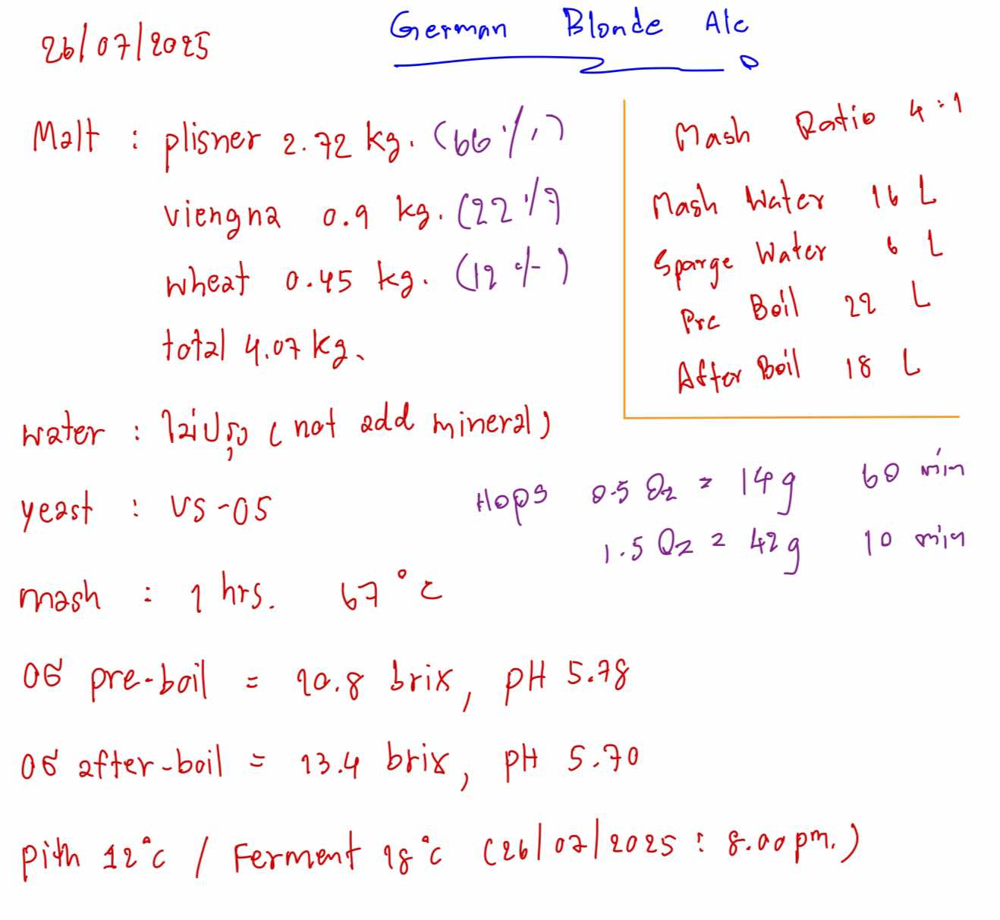

# German Blonde Ale v2

**Related Issue:** [#23](https://github.com/alchemycat/catlabs.me/issues/23)  
**Recipe Date:** 26/07/2025  
**Style:** German Blonde Ale

## Recipe Information

```
Recipe Name: German Blonde Ale v2
Beer Style: German Blonde Ale
Batch Size: 18L (post-boil)
Brew Time: ~5 hours
Boiling Water: 22L
Sparging Water: 6L

OG: 1.065 (13.4 Brix)
FG: 1.012 (estimated)
IBU: ~25 (estimated)
SRM: 4
ABV: 7% (estimated)
```

## Ingredients

```
Malt:
Pilsner 2.92kg (66%)
Vienna 0.9kg (22%)
Wheat 0.45kg (12%)

Hops:
Unknown variety 14g @ 60min
Unknown variety 42g @ 10min

Yeast:
US-05

Brewing Salt:
None (soft water profile, 121.4ppm)

Mashing: 67°C, 60min (Medium body)
```

## Process Notes

1. **Water Profile**: Very soft water (121.4ppm), no mineral additions
2. **Mash**: Single infusion at 67°C for 60 minutes (4:1 water-to-grain ratio)
3. **Boil**: 60 minutes total
   - 14g hops @ 60 minutes (bittering)
   - 42g hops @ 10 minutes (flavor/aroma)
4. **Fermentation**: 
   - Pitch at 11°C
   - Ferment at 18°C
   - Cell count noted: 102025 @ 8:00pm
5. **pH**: 
   - Pre-boil: 5.98
   - Post-boil: 5.90

## Brewing Notes

- Second version of German Blonde Ale recipe
- Hop varieties not specified in original notes
- Clean fermentation profile with US-05
- Wheat addition (12%) for head retention and body
- Very soft water profile without mineral additions
- Medium body target with 67°C mash temperature

## Measurements

- **Pre-boil Gravity**: 10.8 Brix
- **Post-boil Gravity**: 13.4 Brix
- **Pre-boil pH**: 5.98
- **Post-boil pH**: 5.90
- **Pitch Temperature**: 11°C
- **Fermentation Temperature**: 18°C

## Original Recipe Image

