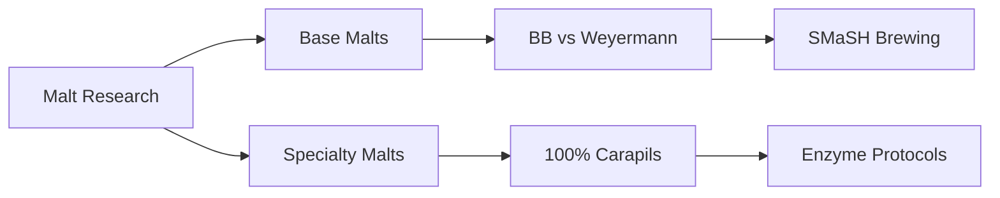

# 🕸️ Research Connection Map

This page helps visualize connections between brewing research topics.

## Major Research Themes

### Malt Studies Network

## Cross-References

### By Brewing Method
- **SMaSH Brewing**: [[001-research-outputs/ingredients/issue-1-pale-malt-comparison-bb-weyermann|Pale Malt Comparison]]
- **Enzyme Usage**: [[001-research-outputs/specialty/issue-3-100-percent-carapils-beer-analysis|100% Carapils]]

### By Technical Challenge
- **Diastatic Power**: Links carapils research to enzyme protocols
- **Malt Comparison**: Links pale malt studies to recipe development

## Research Lineage

1. **Issue #1** → Pale Malt Comparison → SMaSH Recipe Development
2. **Issue #3** → 100% Carapils → Enzyme Protocol Research

---
Use Obsidian's Graph View (Ctrl/Cmd + G) to visualize all connections