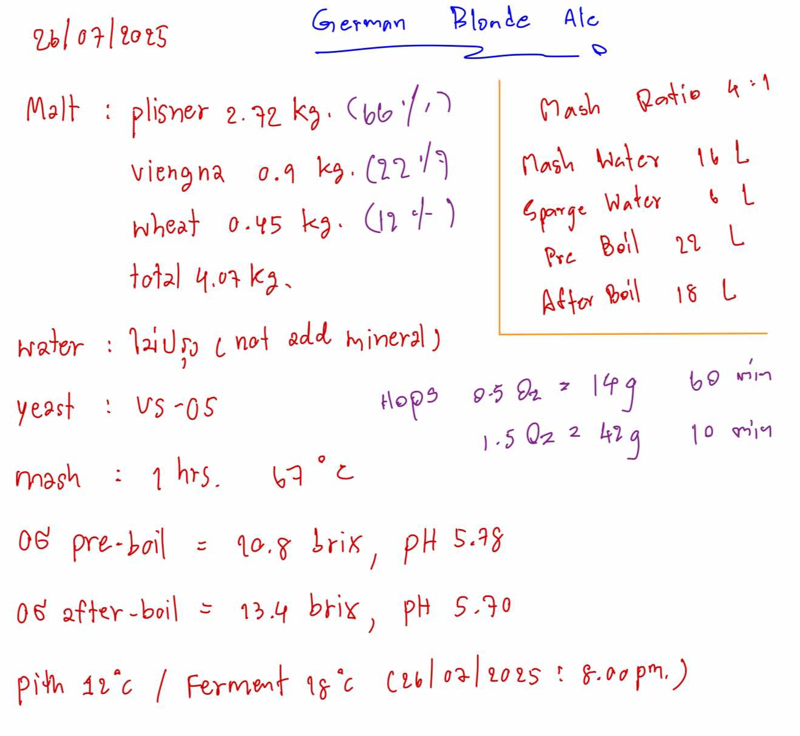

# German Blonde Ale

A clean, easy-drinking blonde ale with a soft malt character.

## Ingredients

**Batch Size:** 18L

### Malts
- Pilsner: 2.92 kg (66%)
- Vienna: 0.9 kg (22%)
- Wheat: 0.45 kg (12%)

### Hops
- 14g @ 60 min (bittering)
- 42g @ 10 min (flavor/aroma)

### Yeast
- US-05

### Water
- Soft profile (121ppm)
- No mineral additions

## Process

1. **Mash:** 67°C for 60 minutes
2. **Boil:** 60 minutes
3. **Fermentation:** Pitch at 11°C, ferment at 18°C

## Numbers
- OG: 1.065
- FG: 1.012
- ABV: 7%
- IBU: ~25

## Notes
- Great summer beer
- Wheat gives nice head retention
- Clean fermentation with US-05

## Original Recipe
